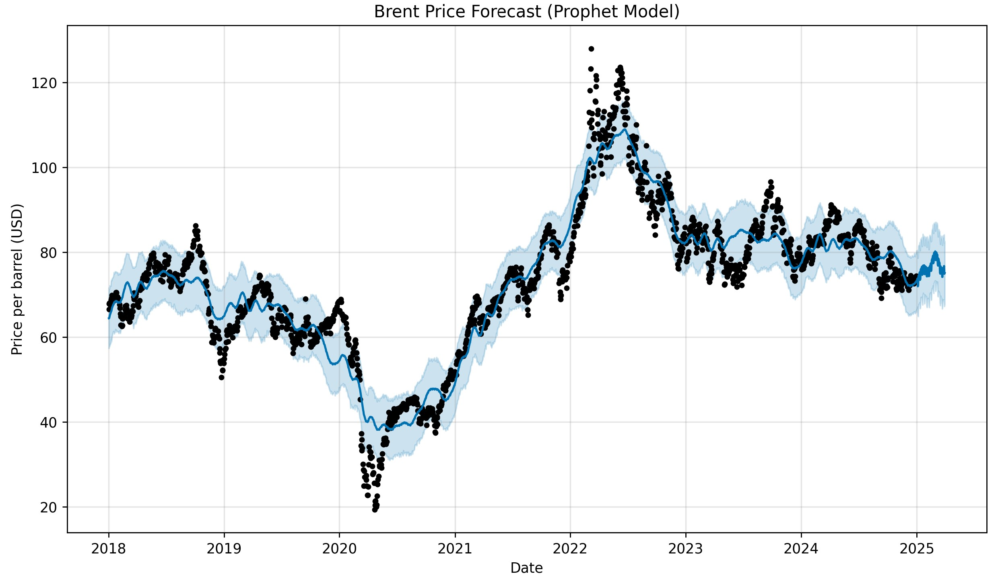

# SmartCrude -- AI Optimization for Crude Oil Trading

## Name of the author: Yousfi Youcef

## Summary
SmartCrude is a Python-based project that leverages artificial intelligence techniques to predict crude oil prices (Brent or WTI) and optimize buy and sell decisions for an oil company.
The system uses publicly available market data and aims to enhance trading profitability by making smarter, day-to-day decisions.

## Preface

The starting point of this project is to optimize trading
(buying/selling) within the oil industry.

Such optimization necessarily requires the use of several AI
technologies, including:

-   **Machine Learning (ML)** for **price prediction** (crude oil,
    refined products, or fuels), **trend detection**, and **time series
    analysis**.

-   **Reinforcement Learning (RL)** for **dynamic optimization of
    buy/sell decisions** based on **costs, inventory, and risks**.

-   **Natural Language Processing (NLP)** for the **analysis of
    geopolitical news**, **climatic events**, or **regulatory changes**
    impacting the markets.

-   **Deep Learning (LSTM/GRU)** for **modeling complex time series**
    (historical prices, macroeconomic data).

-   **Mathematical Optimization** for **profit maximization under
    constraints** (storage, logistics costs, contracts).

To reduce project complexity, a choice had to be made between trading in
**crude oil**, **refined oil products** (gasoline, diesel, kerosene), or
**end-consumer fuels**.\
**I chose crude oil (Brent or WTI)** because:

-   The data is **easily and freely accessible** (Yahoo Finance, EIA,
    ICE, OPEC)

-   **Forecasting models are well documented** (widely used in AI)

-   It has **sufficient volatility** to generate value through
    optimization

-   It has a **direct impact for an oil company**: crude trading is the
    **core business**

-   It is **compatible with real-time or daily strategies**

## 1.Basic Idea in a Few Words

**Project title:**\
SmartCrude -- AI Optimization for Crude Oil Trading

**Brief description:**\
SmartCrude is a Python-based project that leverages artificial
intelligence techniques to **predict crude oil prices** (Brent or WTI)
and **optimize buy and sell decisions** for an oil company.\
The system uses **publicly available market data** and aims to **enhance
trading profitability** by making **smarter, day-to-day decisions**.

## 2. Context

The crude oil market is **one of the most active and volatile in the
world**.\
Each price fluctuation can have a **major financial impact** on an oil
company.\
The main issue is: **how can we anticipate these variations and decide
the optimal time to buy or sell?**

This project addresses that need by:

-   **forecasting short-term prices** (on a daily basis),

-   and **guiding buy/sell decisions** through a data-driven
    optimization strategy.

**Why this topic is relevant:**

-   Crude oil is the **core raw material** in the oil value chain.

-   The data is **abundant, reliable, and freely available**.

-   AI enables **automated decision-making** and helps **reduce human
    error** in a high-stakes economic domain.

**Personal motivation:**

I am passionate about artificial intelligence and interested in applying
it to **real-world, high-impact sectors** like energy.\
This project is an opportunity to apply technical skills (Python, ML) to
a **practical, business-oriented, and strategic problem**.

## 3. Data and AI Techniques

**Required data:**

-   **Crude oil prices**: WTI, Brent (via Yahoo Finance, EIA, ICE)

-   **Traded volumes**, **futures contracts**

-   **External factors**:

    -   Exchange rates (USD/EUR)

    -   Economic data (inventories, global production)

    -   Geopolitical factors (OPEC, conflicts)

    -   Extreme weather conditions, seasonality

**AI techniques applicable to this project:**

**• Time series forecasting:**

-   LSTM (recurrent neural networks)

-   Prophet (Facebook)

-   XGBoost

**Note:** For my Python implementation, **I chose Prophet**, as it
seemed **the simplest to implement**, while being **particularly good at
detecting trends and seasonal effects**.

**• Trading decision optimization:**

-   Reinforcement Learning (Q-learning, Deep Q-Network)

-   Strategies based on **forecast signals**

**• Visualization / dashboard:**

-   Using **Streamlit**, **Dash**, or matplotlib.pyplot

**A demonstration version could use**:\
pandas, scikit-learn, prophet, tensorflow, and yfinance.\
**Given the simplifications made, I used only**:\
pandas, prophet, yfinance, and matplotlib.pyplot.

## 4. How Is It Used

**Usage context:**

-   Used by a **trading team** or **financial analysis department**
    within an oil company.

-   Accessible through a **dashboard** or **API**, displaying:

    -   **Short-term price forecasts**

    -   **Recommendation**: buy, sell, or hold

    -   **Model performance history**

**Target users:**

-   **Traders / analysts** → operational decision-making

-   **Financial management** → purchasing strategy

-   **Developers / data engineers** → implementation and monitoring

## 5. Challenges

-   Modeling of **rare events** (geopolitical crises, market shocks)

-   **Accuracy of very short-term forecasts**, especially in real time

-   **Interpretability** of evolving models (e.g., Prophet)

-   **Dependence on external data**, which may be noisy or incomplete

-   **Risk of overfitting**, to be mitigated through
    **cross-validation** and **regularization**

## 6. What\'s Next?

SmartCrude could evolve toward:

-   **Multi-product integration**: diesel, gasoline, fuels, natural gas

-   A **full SaaS platform** with:

    -   notifications,

    -   decision-making API,

    -   virtual portfolio management

-   **Integration with satellite or industrial sensor data** to
    anticipate market shifts

-   **Hedging and arbitrage strategies**, such as **crack spread**
    (crude vs gasoline price differential)

## 7. Acknowledgments

This project is inspired by:

-   **Applied machine learning courses**

-   **Open-source projects** in algorithmic trading: *Backtrader*,
    *FinRL*

-   **Libraries used**:

    -   pandas, numpy, prophet, matplotlib, yfinance

-   **Public data sources**:

    -   EIA, Yahoo Finance, ICE, OPEC, Investing.com

## 8. Concrete Demonstration

To demonstrate the feasibility of the project, I provide details of the
**technical structure** in Python, such as **file organization**,
**modules**, and **initial code setup**.

**Logical Workflow of the Project**

1.  **Data Collection**

    -   Via yfinance, EIA API, or manual download

    -   Example: data\_loader.py →
        get\_crude\_oil\_data(ticker=\"BZ=F\", start=\"2020-01-01\")

2.  **Preprocessing**

    -   Cleaning, handling missing values, creating time-based features

    -   Example: price lagging, moving averages, normalization

3.  **Modeling**

    -   Using **Prophet**

4.  **Trading Strategy**

    -   Simple rule: **buy if forecast \> current price**

    -   Or AI agent (e.g. **Deep Q-Learning**)

    -   Simulated return based on historical data → trading\_strategy.py

5.  **Evaluation**

    -   MAE, RMSE, **simulated gains**

    -   Visualizations in reports/

6.  **Visualization / App**

    -   Small dashboard for real-time display:

        -   Curves of **actual vs forecasted prices**

        -   **Daily recommendation**: buy, sell, or hold

**Libraries used:**

-   pandas

-   matplotlib

-   prophet

-   yfinance

**Why test a basic forecasting model (e.g., Prophet)?**

This is a **very representative test of the project** because:

-   It is **at the core of the project**: **predicting oil price
    trends**

-   It shows the **power of AI** applied to **real-world economic data**

-   It delivers a **concrete visual output** (actual vs predicted price
    chart)

-   It is **easy to understand** and **valuable even to non-technical
    audiences**

**Setup Requirements:**

To install necessary packages:

pip install yfinance prophet matplotlib pandas

**Main Parts of the Python Script for This Forecasting Model**

**1. Downloading Brent Oil Price Data**

def load\_brent\_data(start=\"2018-01-01\", end=\"2024-12-31\"):

data = yf.download(\"BZ=F\", start=start, end=end)

\# \... Data processing

df = close\_series.reset\_index()

df = df.rename(columns={\'Date\': \'ds\', \'Close\_BZ=F\': \'y\'})

return df

**2. Training the Prophet Model**

def train\_prophet\_model(df):

model = Prophet()

model.fit(df)

return model

**3. Making a 90-Day Forecast**

def make\_forecast(model, periods=30):

future = model.make\_future\_dataframe(periods=periods)

forecast = model.predict(future)

return forecast

**4. Visualizing the Results**

def plot\_forecast(model, forecast):

fig = model.plot(forecast)

plt.title(\"Brent Price Forecast (Prophet model)\")

plt.xlabel(\"Date\")

plt.ylabel(\"Price per barrel (USD)\")

plt.tight\_layout()

plt.show()

**5. Main Script**

if \_\_name\_\_ == \"\_\_main\_\_\":

df = load\_brent\_data()

model = train\_prophet\_model(df)

forecast = make\_forecast(model)

plot\_forecast(model, forecast)

**Example of results and Note on the Limitations of Such a Model**

*Figure showing price over time: Black dots: Historical real data, Blue
line: Model's average forecast, Blue band: Forecast uncertainty or
confidence interval*

The longer the forecast horizon, the more **caution is needed** when
interpreting the results, because **unexpected events** or **global
disruptions** may occur.\
This type of model, based solely on historical data, **cannot foresee
sudden shocks** (crises, wars, geopolitical changes), and its forecasts
may become invalid in such contexts.
